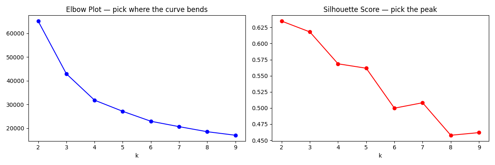
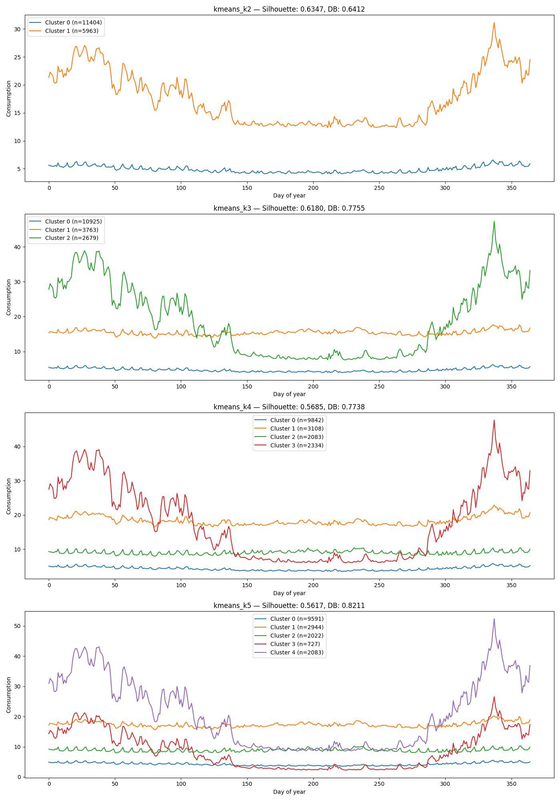

# Clustering Experiment Report
**Date:** 2026-04-06 15:15

**Dataset:** sample_23.csv — 17367 households, 365 days

## Feature Blocks Used
- VolumeFeatures
- CalendarFeatures
- SeasonalFeatures
- TrendFeatures
- PCAFeatures

**Feature matrix shape:** 17367 rows x 14 columns
**Features:** avg_daily_usage, day_to_day_variability, peak_intensity, weekend_avg, weekday_avg, weekend_bias, Winter_Q1, Spring_Q2, Summer_Q3, Autumn_Q4, trend, pca_1, pca_2, pca_3

## Clustering Results

| Method | Clusters | Noise | Silhouette ↑ | Davies-Bouldin ↓ | Calinski-Harabasz ↑ |
|--------|----------|-------|--------------|------------------|---------------------|
| kmeans_k2 | 2 | 0 | 0.6347 | 0.6412 | 32123.0602 |
| kmeans_k3 | 3 | 0 | 0.6180 | 0.7755 | 28847.7191 |
| kmeans_k4 | 4 | 0 | 0.5685 | 0.7738 | 27966.2762 |
| kmeans_k5 | 5 | 0 | 0.5617 | 0.8211 | 25354.5139 |

## Elbow Plot

## Cluster Profiles (all strategies)

### kmeans_k2

| Cluster | Size | Avg Usage | Variability | Peak | Weekend Bias | Trend | Winter | Summer |
|---------|------|-----------|-------------|------|--------------|-------|--------|--------|
| 0 | 11404 | 4.8880 | 0.5538 | 4.0883 | 1.0716 | 0.2210 | 5.3303 | 4.3674 |
| 1 | 5963 | 17.5213 | 0.5120 | 2.9922 | 1.0200 | 1.1949 | 21.8952 | 12.9838 |

### kmeans_k3

| Cluster | Size | Avg Usage | Variability | Peak | Weekend Bias | Trend | Winter | Summer |
|---------|------|-----------|-------------|------|--------------|-------|--------|--------|
| 0 | 10925 | 4.7159 | 0.5535 | 4.1193 | 1.0724 | 0.1818 | 5.1266 | 4.2242 |
| 1 | 3763 | 15.4412 | 0.3608 | 2.5714 | 1.0273 | 0.7621 | 15.4235 | 15.5877 |
| 2 | 2679 | 18.8863 | 0.7334 | 3.6527 | 1.0152 | 1.7885 | 28.8543 | 8.3700 |

### kmeans_k4

| Cluster | Size | Avg Usage | Variability | Peak | Weekend Bias | Trend | Winter | Summer |
|---------|------|-----------|-------------|------|--------------|-------|--------|--------|
| 0 | 9842 | 4.3300 | 0.5707 | 4.2725 | 1.0714 | 0.1751 | 4.7717 | 3.7923 |
| 1 | 3108 | 18.3824 | 0.3666 | 2.5711 | 1.0115 | 1.1482 | 19.0686 | 17.6152 |
| 2 | 2083 | 9.0342 | 0.3836 | 2.6881 | 1.0792 | 0.2287 | 8.9347 | 9.3069 |
| 3 | 2334 | 17.8474 | 0.7769 | 3.7810 | 1.0216 | 1.6611 | 28.4954 | 6.7569 |

### kmeans_k5

| Cluster | Size | Avg Usage | Variability | Peak | Weekend Bias | Trend | Winter | Summer |
|---------|------|-----------|-------------|------|--------------|-------|--------|--------|
| 0 | 9591 | 4.2586 | 0.5649 | 4.2718 | 1.0719 | 0.1558 | 4.6355 | 3.7869 |
| 1 | 2944 | 17.3641 | 0.3573 | 2.5468 | 1.0165 | 0.9310 | 17.5222 | 17.2846 |
| 2 | 2022 | 8.8711 | 0.3823 | 2.6767 | 1.0806 | 0.2531 | 8.7917 | 9.0993 |
| 3 | 727 | 8.6322 | 0.9432 | 4.7053 | 1.0380 | 0.6287 | 14.5994 | 2.6932 |
| 4 | 2083 | 21.1452 | 0.6913 | 3.4388 | 1.0143 | 2.1323 | 32.1232 | 9.4413 |

## Skipped Strategies

| Method | Valid Clusters | Noise Points | Reason |
|--------|---------------|--------------|--------|
| two_stage_k3_tight | 0 | 17367 | All points classified as noise |
| two_stage_k3_loose | 0 | 17367 | All points classified as noise |
| two_stage_k4_tight | 0 | 17367 | All points classified as noise |
| two_stage_k4_loose | 0 | 17367 | All points classified as noise |

### Skipped Strategy Cluster Profiles

#### two_stage_k3_tight

All 17367 points classified as noise — no cluster profiles available.

#### two_stage_k3_loose

All 17367 points classified as noise — no cluster profiles available.

#### two_stage_k4_tight

All 17367 points classified as noise — no cluster profiles available.

#### two_stage_k4_loose

All 17367 points classified as noise — no cluster profiles available.

## Notes
- 
